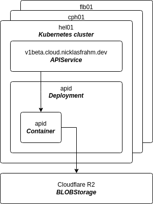

# Architecture

The Kubernetes clusters in all regions should share a common state for _global or shared resources_, such as regions, clusters, machines, etc. To achieve this, a solution is to use an aggregated API server. The challenge then becomes the implementation of the storage layer. Here one could take inspiration from the `kine` project, but instead of using a common database engine, we could use a BLOB storage engine, which provides global replication and consistency guarantees. This would allow us to have a single source of truth for all global resources.

## Challenges

- How to handle the consistency of the data?
  - How to do leader election and ownership across clusters?
  - How would GitOps work for these resources?
